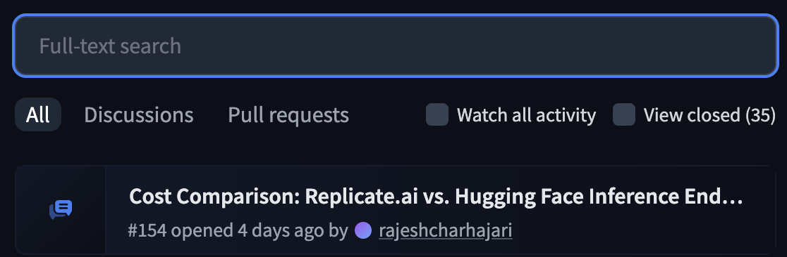
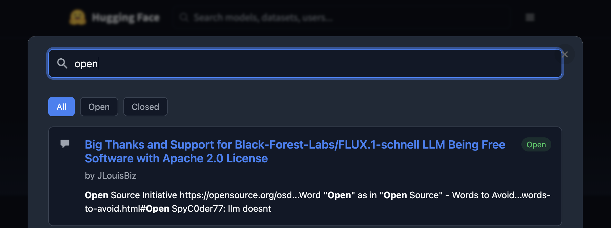
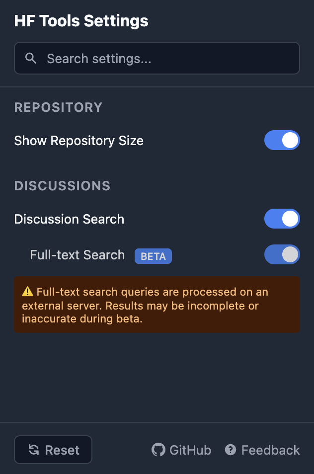
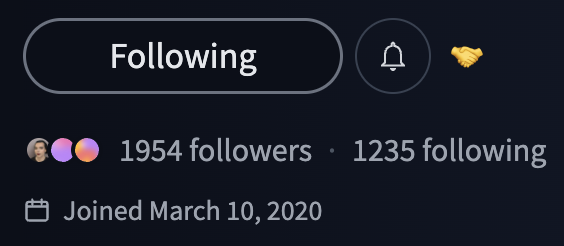

# HF Tools (wip)

A browser extension with useful tools for [Hugging Face](https://huggingface.co).

Only tested on Chrome, might or might not work on Firefox.

[Install for Chrome](https://chromewebstore.google.com/detail/hf-tools/pghpacbbnhhoohoniikaafjcnkcjflch)

Curious how it looks? Check out the [Screenshots](#screenshots) section below.

## Features

- View repository sizes for models and datasets
- Search Discussions w/ full-text search (optional)
- View user join date

## Full-text search

This is a separate service that runs on a different server. It is hosted on Hugging Face Spaces.

How it works: when you enter a search query, it uses the Hugging Face API to build an index of all the discussions under the repository. This index is cached for 24 hours, which means that new discussions will not be indexed until the cache expires.

## Development

1. Clone this repository
2. Open Chrome and go to `chrome://extensions/`
3. Enable "Developer mode" in the top right
4. Click "Load unpacked" and select this directory

### Backend

Running the backend locally:

1. Navigate to `backend`
2. Run `pip install -r requirements.txt`
3. Run `python app.py`

Deploying it to Hugging Face Spaces:

1. Create a new Hugging Face Space with the Gradio template
2. Just drag and drop the contents of the `backend` folder into the new space

Note that the backend URL is hardcoded for now, so you'll need to change it in `content.js` to point to your new space. Search for `iframe.src =` in your IDE and replace the host on that line with your new space's URL. Allowing the backend to be configurable will come in a future release.

## Roadmap

- [x] Repo size estimation
- [x] User join date
- [x] Search Discussions (Banner added as reminder)
    - [x] Full-text discussion search w/ external server
    - [ ] Allow customizing backend URL
- [ ] Optional WYSIWYG editor for Markdown files
    - [ ] Handle image uploads to Hugging Face CDN

## Screenshots

Repo size estimation:

Search Discussions:

Settings:

User join date:

## Disclaimer

This extension is not affiliated with or endorsed by Hugging Face.

## License

The code is licensed under the MIT license. You are free to use, modify, and distribute the code as you see fit, but please give credit. Please also do not misrepresent modifications as the original code or republish the extension to the Chrome Web Store without making significant changes. See the LICENSE file for more details.
